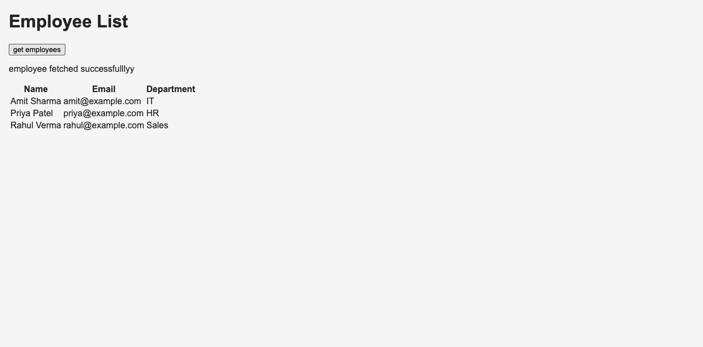

# Q7 - Fetch Employees

A simple React frontend and Express backend. Click **get employees** to show employees in a table. The data is also printed in the browser Console.

**Current stage:** the backend reads employees from local MongoDB. The database is `employeeDB` and the collection is `employees`.

## Run the project

Make sure your local MongoDB service is running. Then open two terminals inside the project folder.

In the first terminal:

```bash
cd backend
npm install
npm run seed
npm start
```

`npm run seed` adds three sample employees only if the collection is empty. It does not add duplicates when run again.

In the second terminal:

```bash
cd frontend
npm install
npm run dev
```

Open the local URL shown by Vite and click **get employees**.

## How it works

1. The button calls `fetchEmployees` in `frontend/src/App.tsx`.
2. `fetch` sends a GET request to `http://localhost:5001/employees`.
3. `backend/server.js` uses `Employee.find()` to read the employees from MongoDB and returns them as JSON.
4. React saves the result with `useState` and displays the rows using `map`.
5. If the request fails, `catch` shows **Failed to fetch employees**.

Each employee has `_id`, `name`, `email`, and `department`. These fields were chosen because the provided screenshot did not specify them.

## View the data in MongoDB Compass

1. Open your `localhost:27017` connection.
2. Click its refresh icon.
3. Expand `employeeDB` and select `employees`.
4. You will see the three saved employees.

The backend connects to `mongodb://127.0.0.1:27017/employeeDB`. No password is required for the current local setup.

## Check the result

- Open browser Developer Tools (on Mac: Command + Option + I).
- In **Console**, click the button and look for `Employees:` followed by the data.
- In **Network**, click the button and find the `employees` request with status **200**.
- Stop the backend with **Control + C** in its terminal. Click the button again. The page should show **Failed to fetch employees** and clear the old rows.
- Restart the backend with `npm start` and click again to load employees.

## Screenshots and submission

Save these screenshots in `screenshots/`:

1. `page.png` - the page showing employees.
2. `console.png` - the browser Console showing the fetched data.
3. `network.png` - the Network tab showing the employees request with status 200.
4. `error.png` - the page after stopping the backend and clicking the button.

Add the final screenshots to this README after capturing them. The `screenshots/README.md` file tracks what has been captured so far.

### Page connected to MongoDB



The earlier `sample-page.png` and `sample-error.png` show the checks made before MongoDB was connected.

For submission, name the project folder `q7-fetch-employees` and push it to your GitHub repository. Include `backend/`, `frontend/`, `screenshots/`, this README, and both package-lock files. The `.gitignore` excludes `node_modules`, build output, and local environment files.

MongoDB is connected and the page screenshot is saved. Console and Network tab screenshots, the final error screenshot, and the GitHub push are still pending.
